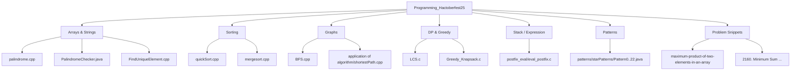
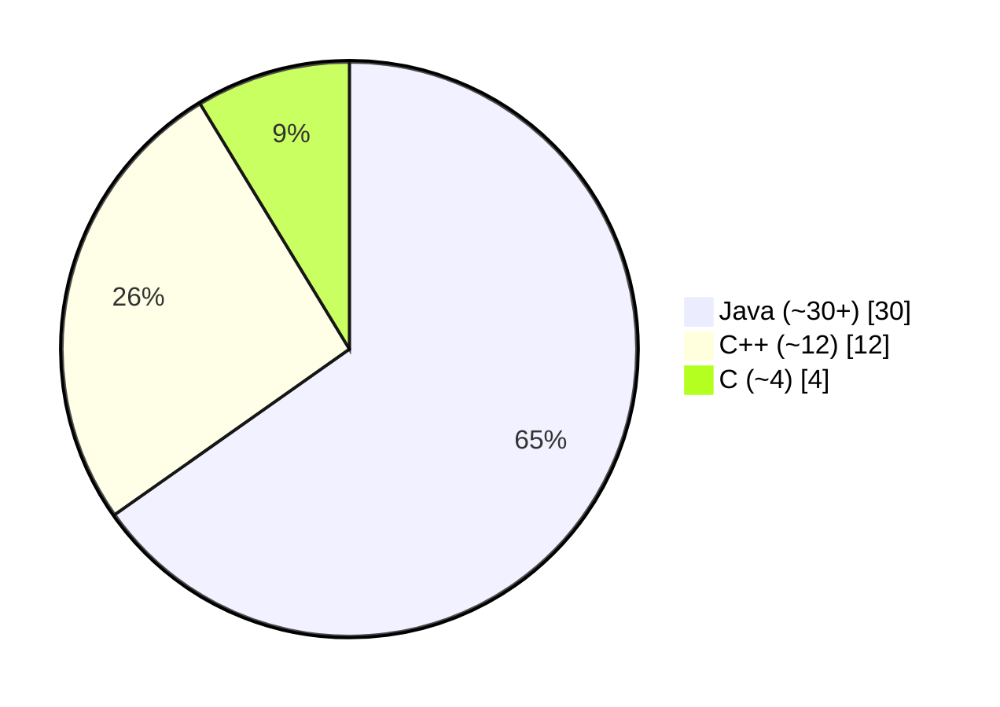

# Programming_Hactoberfest25

A friendly, beginner‑to‑intermediate playground of classic Data Structures and Algorithms in C, C++, and Java. Perfect for practicing DSA, learning by examples.


## What you’ll find

- Arrays and Strings: palindrome checks, rotate array, find unique/greatest elements
- Sorting: Quick Sort, Merge Sort
- Graphs: BFS traversal, shortest path (sample)
- Dynamic Programming and Greedy: LCS, 0/1 knapsack (greedy/fractional)
- Stack/Expression: Postfix evaluation
- Patterns: 20+ star pattern programs in Java for loops practice
- Problem snippets: e.g., Maximum Product of Two Elements, Minimum Sum after Splitting Digits


## Visual overview



Languages by file count (approx.):




## Getting started

You can run any file standalone. Below are Windows PowerShell-friendly steps and examples for each language.

Prerequisites (pick what you need):

- C/C++: MinGW-w64 or LLVM (clang). Ensure `gcc`/`g++` are on PATH.
- Java: JDK 17+ with `javac`/`java` on PATH.


### 1) Run a C example (Greedy Knapsack)

Files: `Greedy_Knapsack.c`

Steps (PowerShell):

```powershell
gcc .\Greedy_Knapsack.c -O2 -std=c11 -o .\knapsack.exe ; .\knapsack.exe
```

Sample input (paste when prompted):

```
3
50
10 60
20 100
30 120
```

Expected output (example):

```
Maximum value in the knapsack: 240.00
```


### 2) Run a C++ example (Quick Sort)

Files: `quickSort.cpp`

Steps (PowerShell):

```powershell
g++ .\quickSort.cpp -O2 -std=c++17 -o .\quicksort.exe ; .\quicksort.exe
```

Expected output (example):

```
Quick Sorting
1 2 3 4 5
```


### 3) Run a Java example (Palindrome Checker)

Files: `PalindromeChecker.java`

Steps (PowerShell):

```powershell
javac .\PalindromeChecker.java ; java PalindromeChecker
```

You can also explore and run any of the Java pattern files under `patterns/starPatterns` to visualize loops.


## Repo structure (short view)

```
Programming_Hactoberfest25/
├─ BFS.cpp
├─ quickSort.cpp
├─ mergesort.cpp
├─ Greedy_Knapsack.c
├─ LCS.c
├─ postfix_eval/
│  └─ eval_postfix.c
├─ patterns/
│  └─ starPatterns/ Pattern0.java … Pattern22.java
├─ Reverse_an_array/
│  └─ ReverseArrayUsingScanner.java
├─ application of algorithm/
│  └─ shortestPath.cpp
├─ count_number_of_odd_even_elements/ soln.cpp
├─ find_the_smallest_element_in_an_array/
│  └─ smallestelementusingScanner.java
├─ findDisjoint/ ArrayDisjoinOrNot.java
├─ 2160. Minimum Sum of Four Digit Number After Splitting Digits
├─ maximum-product-of-two-elements-in-an-array
├─ CONTRIBUTING.md
└─ README.md
```


## How to contribute

New to open source or Hacktoberfest? We’d love your help!

1) Pick a topic/algorithm you’d like to add or improve.
2) Create or enhance a single, focused program (keep input/output simple).
3) Follow our guide in `CONTRIBUTING.md` and open a pull request.

Ideas to get started:

- Add another sorting/searching example with comments
- Port an existing solution between C/C++/Java
- Add unit-style input/output samples in comments
- Improve variable names and docstrings for clarity


## Tips for running and troubleshooting

- If `gcc`/`g++` aren’t found on Windows, install MinGW-w64 and add its `bin` folder to PATH, or use WSL.
- For Java, verify `javac -version` and `java -version` print versions without errors.
- Some examples read from stdin. If the program “hangs,” it’s likely waiting for input—check the source for prompts.
- C vs C++: Compile `.c` files with `gcc` and `.cpp` files with `g++` for fewer surprises.


## FAQ

- Q: Do I need external libraries?  
	A: No. Everything uses standard libraries for C, C++, and Java.

- Q: Is there a specific build system?  
	A: No. Each file is self-contained. Compile and run the one you’re exploring.

- Q: License?  
	A: No explicit license file was found. Contributions are intended for learning and practice.


## Acknowledgements

Thanks to all contributors and learners participating in Hacktoberfest. Have fun, write clear code, and share what you learn!


